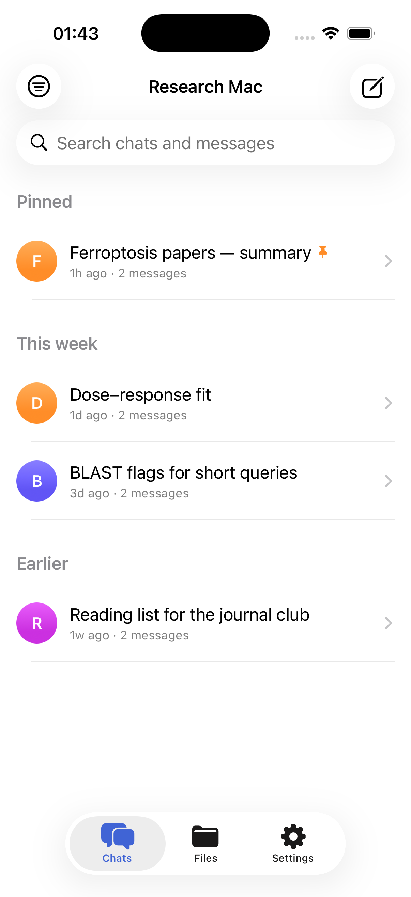
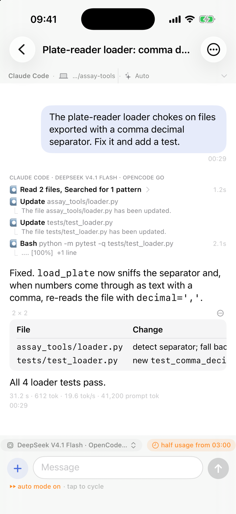
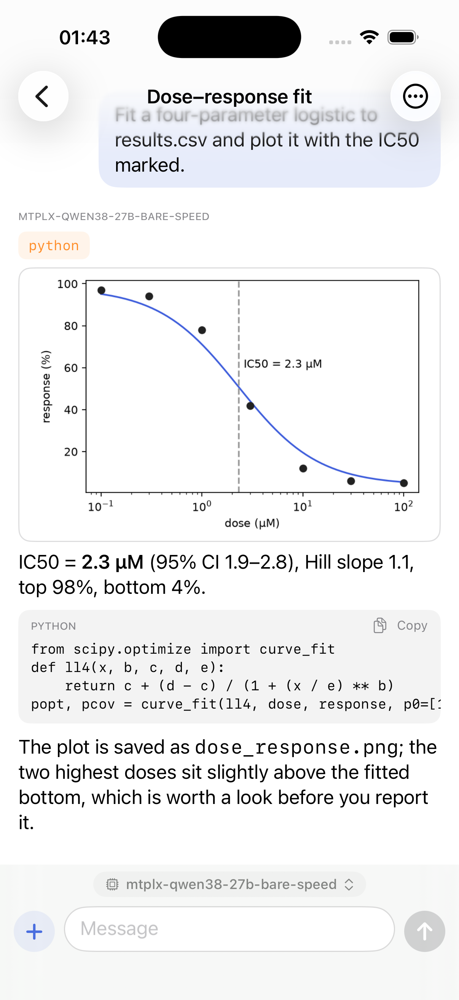
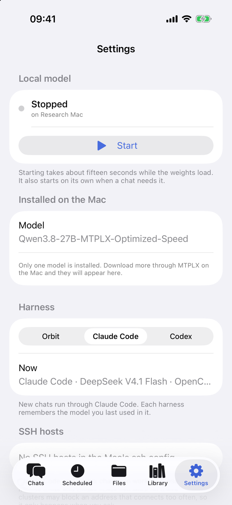

# Orbit for iPhone

The phone app for [Orbit](https://github.com/Micropeptide/Orbit), the research assistant that lives on your own Mac. Your chats, notes, papers and the model that answers all stay on the Mac; this app is a window onto them — live over Tailscale from anywhere, or over your local network at home.

- **Your conversations, live.** The same chats as on the Mac, streaming as they are written, grouped by day, with pin, archive, rename, bin, and a filter by project. Search titles *and* the text of every message, then jump straight to the line.
- **Everything a conversation needs.** Markdown with real tables and code blocks, collapsible reasoning, tool calls as they happen, approval prompts mid-answer. Long-press to copy, quote, edit-and-resend, ask again, or share an answer as text or as an image card. Find inside a chat; `/new`, `/model`, `/compact`, `/find`.
- **Send what you are looking at.** Photos from the library, a picture from the camera, or any file from the Files app — uploaded to the Mac and sent with your message. Plots and pictures render inline; tap to zoom, save to Photos.
- **Run the Mac from your pocket.** Pick the model per chat (the local MLX model, the coding CLI you are signed into, or a hosted API — each answer is labelled with the one that wrote it). Start, stop, restart or switch the local model server. See and trigger the Mac's automatic iCloud backup. Restore from the bin.
- **Works when the Mac is asleep.** Recent conversations are cached for reading offline; a banner says so rather than pretending. An answer that finishes while you are elsewhere notifies you, and the notification opens that chat.
- **Private by construction.** Pairing is a QR code carrying a token that lands in the Keychain; every request is gated by it. Over Tailscale the connection is HTTPS through Tailscale Serve with a real certificate. Optional Face ID lock. Nothing goes to a cloud unless you configured a hosted model yourself.

<p align="center">
  
  
  
  
</p>

## Getting it onto your phone

There is no App Store listing — Orbit talks to *your* Mac, and Apple's review process is a poor fit for an app whose only server is the one under your desk. Three ways in, from easiest to most durable:

| | How | Lasts |
|---|---|---|
| **Sideload the IPA** | Download `Orbit.ipa` from the [latest release](https://github.com/Micropeptide/Orbit-iOS/releases/latest) and install it with [AltStore](https://altstore.io), [Sideloadly](https://sideloadly.io) or Apple Configurator. They sign it with your Apple ID. | 7 days with a free Apple ID (AltStore refreshes it for you in the background); a year with a paid developer account |
| **Build from source** | `xcodegen generate && open Orbit.xcodeproj`, choose your team under *Signing & Capabilities*, run on your phone. Needs Xcode 16+ and [XcodeGen](https://github.com/yonaskolb/XcodeGen). | same as above |
| **From the Mac running Orbit** | `bin/orbit-phone-install` in the main repo builds, signs for your paired phone and installs over USB or Wi-Fi; a nightly LaunchAgent keeps a free-ID signature alive. | indefinitely, while the phone is reachable |

The IPA in the release is **unsigned** — it carries no certificate and no profile, which is exactly why you can sign it with your own account.

The first time, iOS asks you to trust the developer certificate under *Settings → General → VPN & Device Management*.

## Pairing

1. On the Mac: Orbit → **Settings → Phone** → choose **Tailscale** (works anywhere; the phone needs the Tailscale app connected to the same tailnet) or **Local network** (same Wi-Fi) → restart Orbit.
2. On the phone: open Orbit → **Scan the QR code** the Mac shows.

That is the whole setup. The QR carries the address, fallback addresses and a pairing token; the app tries the alternatives by itself and keeps learning new ones from the Mac, so you scan once. **Rotate token** on the Mac unpairs every device at once.

If you are building your own phone app for a service on your Mac, the Tailscale path — Serve, HTTPS, the loopback-trust pitfall, ATS — is written up in the main repo's [tailnet playbook](https://github.com/Micropeptide/Orbit/blob/main/docs/tailnet-playbook.md).

## What it deliberately does not do

- It never stores a conversation the Mac has not accepted. The offline copy is for reading; the Mac is the only database.
- Deleting a chat or a file moves it to the bin on the Mac, never past it.
- "Edit and resend" tells the Mac what it expects to cut; if the conversation changed elsewhere, the Mac refuses rather than cutting the wrong turn.

## Building

```bash
git clone https://github.com/Micropeptide/Orbit-iOS
cd Orbit-iOS
xcodegen generate
open Orbit.xcodeproj
```

iOS 17 or later. SwiftUI, no dependencies. The source here mirrors `ios/` in the main [Orbit](https://github.com/Micropeptide/Orbit) repository, which is where development happens; releases are cut from there.

## Requirements

- A Mac running [Orbit](https://github.com/Micropeptide/Orbit) with phone access turned on.
- iPhone or iPad on iOS 17+. On an iPad the chat list and the conversation sit side by side.

MIT licensed. Made by Micropeptide.
